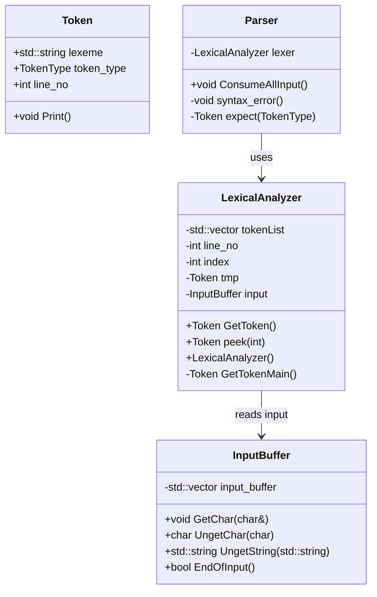
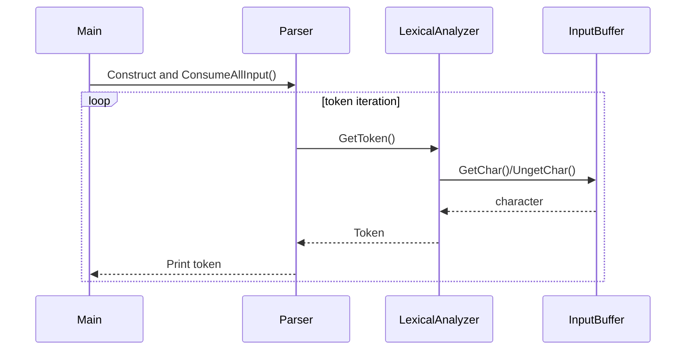

#  simple compiler

#####  table of contents

<small>
1 introduction
2 input format
    grammar and tokens
        grammar
        tokens
    examples
        ex01
            ex01 input
            ex01 output
        ex02
            ex02 input
            ex02 output
        ex03
            ex03 input
            ex03 output
        ex04
            ex04 input
            ex04 output
        ex05
            ex05 input
            ex05 output
</small>

##  1  introduction

a simple compiler using a recursive descent parser along with simple data structures for semantic checking and program execution.

**compiler input sections**

1.  `TASKS` section - contains a list of one or more numbers of tasks to be executed by the compiler
2.  `POLY` section -  contains a list of polynomial declarations
3.  `EXECUTE` section - contains a sequence of `INPUT`, `OUTPUT`, and assignment statements
4.  `INPUTS` section - contains a sequence of integers used as inputs for the `EXECUTE` section

**compiler behavior**

1.  parse input
2.  if syntax error exists, produce synatx error message
3.  if syntax is correct, perform semantic analysis
4.  if semantic errors exist, produce semantic error messages
5.  if syntax and semantics are correct, performa additional semantic analysis based on specified tasks
6.  execute the statements in the `EXECUTE` section
7.  generate output for `OUTPUT` statements

##  2  input format

###  grammar and tokens

####  grammar

the input of the program is specified by the following context free grammar

```
program -> tasks_sectionpoly_sectionexecute_sectioninputs_section
tasks_section -> TASKSnum_list
num_list -> NUM
poly_section -> POLYpoly_decl_list
poly_dec_list -> poly_decl
poly_decl -> poly_headerEQUALpoly_bodySEMICOLON
poly_header -> poly_name
poly_header -> poly_nameLPARENid_listRPAREN
id_list -> ID
id_list -> IDCOMMAid_list
poly_name -> ID
poly_body -> term_list
term_list -> terms
term_list -> termadd_operatorterm_list
term -> monomial_list
term -> coefficientmonomial_list
term -> coefficient
monomial_list -> monomial
monomial_list -> monomialmonomial_list
monomial -> primary
monomial -> primaryexponent
primary -> ID
primary -> LPARENterm_listRPAREN
exponent -> POWERNUM
add_operator -> PLUS
add_operator -> MINUS
coefficient -> NUM
execute_section -> EXECUTEstatement_list
statement_list -> statement
statement_list -> statementstatement_list
statement -> input_statement
statement -> output_statement
input_statement -> INPUTIDSEMICOLON
output_statement -> OUTPUTIDSEMICOLON
assign_statement -> IDEQUALpoly_evaluationSEMICOLON
poly_evaluation -> poly_nameLPARENargument_listRPAREN
argument_list -> argument
argument_list -> argumentCOMMAlargument_list
argument -> ID
argument -> poly_evaluation
inputs_section -> INPUTSnum_list
```

####  tokens

the following is a definition of tokens

```
char        = a | b | ... | z | A | B | ... | Z | 0 | 1 | ... | 192
letter      = a | b | ... | z | A | B | ... | z
pdigit      = 1 | 2 | 3 | 4 | 5 | 6 | 7 | 8 | 9
digit       = 0 | 1 | 2 | 3 | 4 | 5 | 6 | 7 | 8 | 9

SEMICOLON   = ;
COMMA       = ,
PLUS        = +
MINUX       = -
POWER       = ^
EQUAL       = =
LPAREN      = (
RPAREN      = )
TASKS       = (T).(A).(S).(K).(S)
POLY        = (P).(O).(L).(Y)
EXECUTE     = (E).(X).(E).(C).(U).(T).(E)
INPUT       = (I).(N).(P).(U).(T)
OUTPUT      = (O).(U).(T).(P).(U).(T)
INPUTS      = (I).(N).(P).(U).(T).(S)
NUM         = 0 | pdigit . digit*
ID          = letter . char*
```

the code provided has a class `LexicalAnalyzer` with methods `GetToken()`, `peek()`, and `expect()`.  the parser will use the functions provided to `peek()` at tokens or `expect()` tokens as needed.  do not change any functions provided in `inputbuf.cc`, `inputbuf.h`, `lexer.cc`, `lexer.h`.  in order to use the provided methods, first instantiate only one lexer object of the class `LexicalAnalyzer` and call the methods on this instance.

what you need to do is write a parser to parse the input according to the context free grammar and produce a syntax error.  your program will check for semantic errors, and depending on the tasks list, will execute more semantic checks.  to achieve that, your parser will store the program in appropriate data structures that facilitate semantic analysis and allow your compiler to execute the statement lists in the `execute_section`.  for now don't worry how that is achieved, we will explain in more detail in the implementation guide.

##  examples

the following are examples of input to your compiler with corresponding outputs.  the output will be explained in more detail later.  each of these examples has task numbers 1 and 2 listed in the `tasks_section`.  they will have the following meanings

-  `1` listed means that your program should perform syntax and semantic checking
-  `2` listed means that your program should produce the output of the output statements if there are no syntax and no semantic errors

###  ex01

this example shows two polynomial declaractions and a `EXECUTE` section in which the polynomials are evaluated with arguments `4` and `2` respectively.  the output of the program is 17, 3.  the sequence of numbers at the end (in the input_section) is ignored because there are no `INPUT` statements.

####  ex01 input

```
TASKS
  1 2
POLY
  F = x^2 + 1;
  G = x + 1;
EXECUTE
  X = F(4);
  Y = G(2);
  OUTPUT X;
  OUTPUT Y;
INPUTS
  1 2 3 18 19
```

```
 1    TASKS
 2      1 2
 3    POLY
 4      F = x^2 + 1;
 5      G = x + 1;
 6    EXECUTE
 7      X = F(4);
 8      Y = G(2);
 9      OUTPUT X;
10      OUTPUT Y;
11    INPUTS
12      1 2 3 18 19
```

```
 1 -> | TASKS             |
 2    |   1 2             |
 3    | POLY              |
 4    |   F = x^2 + 1;    |
 5    |   G = x + 1;      |
 6    | EXECUTE           |
 7    |   X = F(4);       |
 8    |   Y = G(2);       |
 9    |   OUTPUT X;       |
10    |   OUTPUT Y;       |
11    | INPUTS            |
12    |   1 2 3 18 19     |
```


####  ex01 output

```
17
3
```

###  ex02

this is similar to ex02 but here we have two `INPUT` statements.  the first `INPUT` statement reads a value for `X` from the sequence of numbers and `X` gets the value 1.  the secon `INPUT` statement reads a value for `Y` which gets the value 2.  here the output will be 2.  note that the values, `3`, `18`, `19` are not read and do not affect the execution of the program.

####  ex02 input

```
TASKS
  1 2
POLY
  F = x^2 + 1;
  G = x + 1;
EXECUTE
  INPUT X; INPUT
  Y;
  X = F(X); Y =
  G(Y);
  OUTPUT X;
INPUTS
  1 2 3 18 19
```

####  ex02 output

```
2
```

###  ex03

note that there are line numbers added to this example.  these line numbers are not part of the input and are added only to refer to specific lines of the program.  in this example, which looks almost the same as the previous example, there is a syntax error because there is a missing semicolon on line 4.  the output of the program should be `SYNTAX ERROR !!!!!&%!!`

####  ex03 input

```
 1    TASKS
 2      1 2
 3    POLY
 4      F = x^2 + 1;
 5      G = x + 1;
 6    EXECUTE
 7      INPUT X;
 8      INPUT Y;
 9      X = F(X);
10      Y = G(Y);
11      OUTPUT X;
12    INPUTS
13      1 2 3 18 19
```

####  ex03 output

```
SYNTAX ERROR !!!!!&%!!
```

###  ex04

in this example, the polynomial G has two variables which are given explicitly (in the absence of explicitly named variables, the variable is lower case x by defualt).  the output is 2 6.  the following is the set of steps that it goes through.

```
Z = 1
W = 2
X = F(Z) = F(1) = x^2 + 1 = 1^2 + 1 = 2
Y = G(Z, W) = G(1, 2) = X Y^2 + X Y = 1 2^2 + 1 2 = 6
X = 2
Y = 6
OUTPUT X -> 2
OUTPUT Y -> 6
```

####  ex04 input

```
 1    TASKS
 2      1 2
 3    POLY
 4      F = x^2 + 1;
 5      G(X, Y) = X Y^2 + X Y;
 6    EXECUTE
 7      INPUT Z;
 8      INPUT W;
 9      X = F(Z);
10      Y = G(Z, W);
11      OUTPUT X;
12      OUTPUT Y;
13    INPUTS
14      1 2 3 18 19
```

####  ex04 output

```
2
6
```

###  ex05

this example is similar to example 04, but it has a problem.  the polynomial g declared with two variables `X` and `Y` but its equation (called `poly_body` in the grammar) has `Z` which is different from `X` and `Y`.  the output captures this error (see below for error codes and their format)

####  ex05 input

```
 1    TASKS
 2      1 2
 3    POLY
 4      F = x^2 + 1;
 5      G(X, Y) = X Y^2 + X Z;
 6    EXECUTE
 7      INPUT Z;
 8      INPUT W;
 9      X = F(Z);
10      Y = G(Z, W);
11      OUTPUT X;
12      OUTPUT Y;
13    INPUTS
14      1 2 3 18 19
```

####  ex05 output

```
Semantic Error Code 2: 5
```

##  3  tasks and their priorities

the task numbers specify what your program should do with the input program.  task 1 is one of the larger tasks and, but it is not graded as one big task.  the following explains the functionality of eahc task.

####  task 1 -  error

functionalities - syntax checking and semantic error checking

####  task 2 -  output
****
functionalities -  task 2 requires your compiler to produce the output that should be produced by the output statement of the program

####  task 3 -  variable used but not explicitly initialized

task 3 requires the compiler to produce a warning about uninitialized variables.  a variable is uninitialized when a variable appears on the right hand side of an assignment statement without having previously appeared on the left hand side of an assignment statement or in an `INPUT` statement.  this will result in a warning message.  however, it is not considered a semantic error.  the execution can proceed assuming the variable is initially zero.

####  task 4 -  useless assignments

this happens when a variable value is calculated, but the variable is not used later in the right hand side of an assignment or in an `OUTPUT` statement.

####  task 5 -  polynomial degree

this task requires that the degree of all the polynomials in the polynomial sections are calculated and outputted.

detailed descriptions of these tasks and what the output should be for each of them is given in the sections that follow.  the remainder of this section explains what the output of the program should be when multiple task numbers are listed in the `tasks_section`.

if task 1 is listed in the `tasks_section`, then task 1 should be executed.  remember that task 1 performs syntax error checking and semantic error checking.  if the execution of task 1 results in an error, and task 1 is listed in the `tasks_section`, then your program should only output the error message (as described below) and exit.  if task 1 results in an error (syntax or semantic) no other tasks will be executed even if they are listed in the `tasks_section`.  if task 1 is listed in the `tasks_section` and does not result in an error message, then task 1 produces no output.  in that case, the outputs of the other tasks that are listed in the `tasks_section` should be produced by the program.  the order of these outputs should be according to the task numbers.  so, first the output of task 2 is produced (if task 2 is listed in the `tasks_section`), then the output of task 3 is produced (if task 3 is listed in the `task_section`) and so on.

if task 1 is not listed in the `tasks_section`, task 1 still needs to be executed.  if task 1's execution results in an error, then your program should output nothing in this case.  if task 1 is not listed and task 1's execution does not result in an error, then the output of the other tasks that are listed in the `tasks_section` should be produced by the program.  the order of these outputs should be according to the task numbers.  so, first the output of task 2 is produced, then teh output of task 3 is produced (if task 3 is listed in the `task_secton`) and so on.

keep in mind that tasks are not necessarily listed in order in the `tasks_section` and they can even be repeated.  for instance, we can have the following `TASKS` secton:

```
TASKS
  1 3 4 1 2 3
------same as------
TASKS
  1 2 3 4
```

in this example, some tasks are listed more than once.  later occurrences are ignored.  so, the `tasks_section` aboe is equivalent to `TASKS 1 2 3 4`.  in the implementation guide, I will explain a simple way to read the list and sort the task numbers using a boolean array.

##  4  task 1 - syntax and semantic checking

for task 1, the solution should detect syntax and semantic errors in the input program as specified in this section.

###  syntax checking

if the input is not correct syntactially, your program should output `SYNTAX ERROR !!!!!&%!!`

if there is a syntax error, the output of your program should exactly match the output given above.  no other output should be produced in this case, and your program should exit after producing the syntax error message.  the provided `parser.*` skeleton files already have a function that produces the message above and exists the program.

###  semantic checking

semantic checking also checks for invalid input.

unlike syntax checking semantic checking requires knowledge of the specific **lexemes** and does not simply look at the input as a sequence of tokens (token types).

the following are the rules for semantic checking

1.  polynomial declared more than once - semantic error code 1
2.  invalid monomial name - semantic error code 2
3.  attempted evaluation of undeclared polynomial - semantic error code 3
4.  wrong number of arguments - semantic error code 4

####  semantic error code 1 - polynomial declared more than once

if the same `polynomial_name` is used in two or more different `polynomial_header`'s, then we have the error _polynomial declared more than once_. the output in this case should be of the form

```
Semantic Error Code 1: <line no 1> <line no 2> ... <line no k>
```

where `<line no 1>` through `<line no k>` are the numbers of each of the lines in which a duplicate `polynomial_name` appears in a polynomial header.  the numbers should be sorted from smallest to largest


##  9  requirements

write a program to generate the correct ouput for a given input as described above.  start by writing the parser and make sure that it correctly parses the input before attemping to implement the result of the project.

you will be provided with a number of example test cases.  these test cases are not meant to be complete or even close to complete.  they are only provided as examples to complement the project description.

it is your responsibility to make sure that your implementation satisfies the requirements given in this document, and you should develop your own test cases to do so.

##  10 instructions

-  read this document carefully
-  read the implementation guide
-


# Program Architecture

This document describes the main classes in `src/provided_code` and shows the flow of control when the program runs.

## Class Diagram



## Flow of Control


